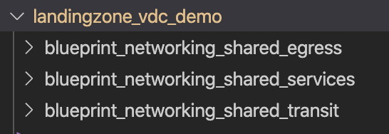
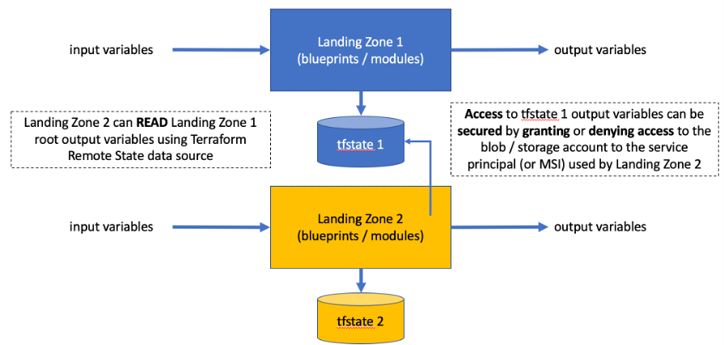

# Composing a complete environment with landing zones

A landing zone describes a complex environment running on Microsoft Azure.

From the software prospective, the landing zone is the element orchestrating the service composition by calling different blueprints *(sometimes also referred as services)* to deploy the complete environment as in the picture below: <br>


In our approach, a landing zone:

- Manages a Terraform state file, and outputs which might be reused by other landing zones.
- Assembles the blueprints/services.
- Manages a deployment for a set of regions (calling the blueprints which are by convention mono-region).
- Locks a version of azurerm_provider for which is has been tested.
- Is versioned in GitHub repository.

## Composing within the landing zone

A landing zones will invoke mainly:

- Resources (as called directly from the azurerm provider) - for the elements that are not highly reusable, and for the stitching of modules/blueprints when needed.
- Blueprints or services - stereotyped architecture elements (DMZ blueprint, egress blueprint, etc.)

Depending on the blueprints maturity, you can:<br>

- **store them locally** in the landing zone files hierarchy. This is a good approach when you start writing a landing zones and are not sure of the reusability of the elements you are developing. For example, the vdc_demo landing zone uses a set of local blueprints as below: </br>
  <br> You will call each blueprint as a module: <br>

```hcl

module "blueprint_networking_shared_egress" {
    source = "./blueprint_networking_shared_egress"
    
    ...
}
  
```

- **reuse them from the official repos** from Azure Cloud Adoption Framework blueprints. We recommend/require that you use strict versionning. Please refer to the [following repository](https://github.com/aztfmod/blueprints) for the standard blueprints. <br>
You will call each blueprint as a module **please note the call to a specific GitHub release and/or a branch**:

```hcl
module "blueprint_foundations" {
    source = "github.com/aztfmod/blueprints?ref=1911.1/blueprint_foundations"

    ...
}
```

In the following code, you can see, within the *caf_foundations* landing zone, we are calling some variables (var.global_settings, etc.), but also the output called *resource_group_hub_names* from *blueprint_foundations_accounting* (module.blueprint_foundations_accounting.resource_group_hub_names)

```hcl
module "blueprint_foundations_security" {
    source                              = "./blueprint_foundations_security/"

    location                            = var.global_settings.location_map.region1
    tags_hub                            = var.global_settings.tags_hub
    resource_groups_hub                 = module.blueprint_foundations_accounting.resource_group_hub_names
    log_analytics                       = module.blueprint_foundations_accounting.log_analytics_workspace

    security_settings                   = var.security_settings
}
```

<br>

## Composing from multiples landing zones

To deliver a complete environment, just as for any other software project, you **want** to avoid a monolithic configuration and compose an environment calling multiple landing zones.

With Terraform, you can read a state files' output and use it as input variables for another landing zone. We use this feature as a way to compose complex architectures.



From the code prospective, this data exchange between landing zones is done by calling a Terraform data remote state object, as in the following example:

```hcl
data "terraform_remote_state" "landingzone_caf_foundations" {
  backend = "azurerm"
  config = {
    storage_account_name  = var.lowerlevel_storage_account_name
    container_name        = var.lowerlevel_container_name
    key                   = "landingzone_caf_foundations.tfstate"
    resource_group_name   = var.lowerlevel_resource_group_name
  }
}
```

As a convention in our code, and in order to simplify code readability, we create local variables that represent the data (variables) that we read from the output Terraform state, below is an example:

```hcl
locals {
    variable          = data.terraform_remote_state.landingzone_caf_foundations.outputs.variable
}
```

The decision factors to create/manage layers:

- Different personas.
- Different levels of privileges.
- Different frequency of changes.
- Blast radius control.

Downside:

- Code might be harder to manage.
- Some layers might not be obvious cut in one or another layer.

Whereas you can read a state file from Terraform and use the information in it, we implement a hierarchy model that landing zones must follow to enforce a good separation of duty, this model is reviewed in more details in the "CAF landing zones hierarchy model" article.

[Back to summary](../README.md)
